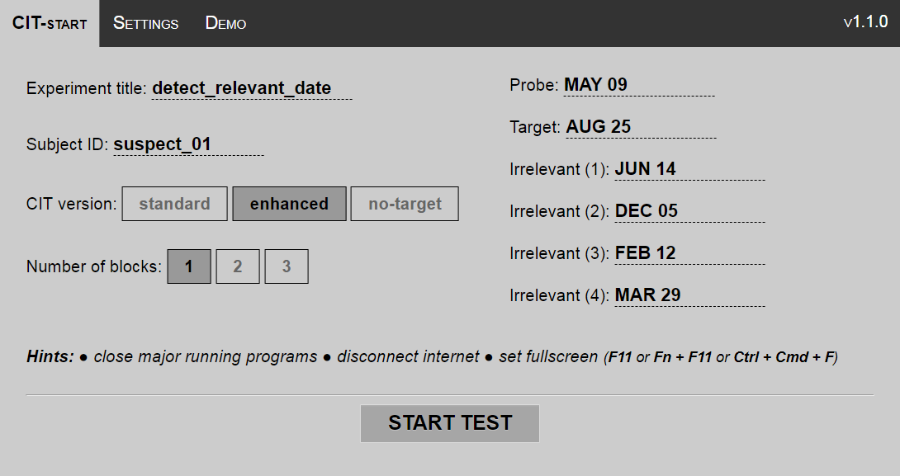
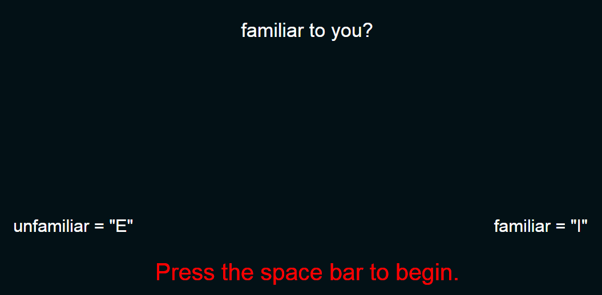
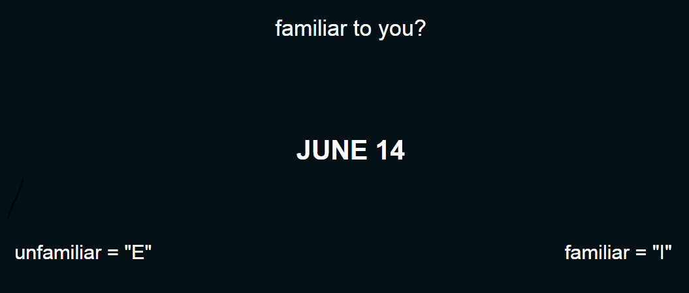
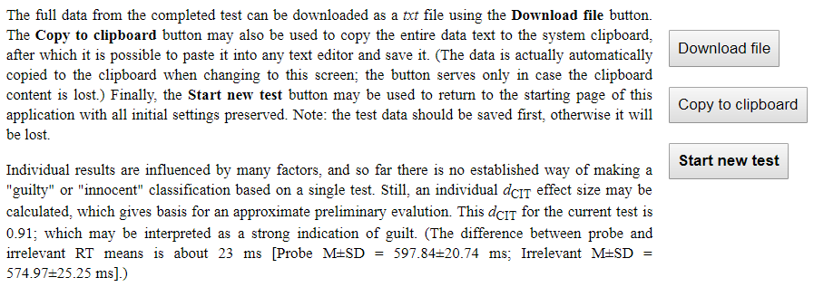

**Concealed Information Test application**

January 19, 2019

Author: Gáspár Lukács

Contact: gaspar.lukacs@univie.ac.at

Below you find the documentation of the of the Concealed Information Test application (v1.0.1), by sections _Requirements and usage instructions_, _Introduction_, _The CIT versions_, _Task design_, _Settings_, _Results_, _Evaluation_, _Planned features_, _Support_, _References_.

Note that this documentation is also available in PDF format: [CITapp_documentation.pdf](https://github.com/gasparl/citapp_pc/blob/master/CITapp_documentation.pdf "CITapp_documentation")

**Requirements and usage instructions**

This application needs no installation whatsoever, it can and should be run in a _Google Chrome_ browser (v25 or above). There are no further dependencies or system requirements. The entire application works offline: no internet connection is needed.

The easiest way to use the application is via the [site of the repository itself](https://gasparl.github.io/citapp_pc/CITapp.html "CITapp"). (Note that no data is saved or sent anywhere on the server. In fact, once loaded into the browser, the test may again be used entirely offline as well.)

However, the application can of course also be downloaded or forked and/or cloned via Git. This has three advantages. Firstly, the application will not be affected by updates. This may be desired when it is used for an experimental study where the interface and all settings are preferred to remain identical throughout the data collection. Secondly, the application will always be available offline (in case of downloading it). Thirdly, the code can then be modified for specific purposes. For example, in a simple case, the experiment title name and settings may be given a new default values to be used in a series of tests of a study.

If the application is downloaded on a PC into a local folder (including all directories and files in the repository), it can simply be opened in Chrome (e.g., by dragging the main _CITapp.html_ into a new window or tab of the open browser). Otherwise, these file can also be uploaded to a server to make it available online. If the application is forked or copied into a new GitHub repository, a webpage for the application may also be easily created using GitHub Pages (available under repository Settings).

**Introduction**

No deception detection method has been scientifically proven to achieve perfect or close to perfect accuracies in discriminating deceptive ("guilty") persons from truth-telling ("innocent") ones, notwithstanding the claims by some commercial services and products. The most efficient "Concealed Information Test" version in the present application ("enhanced") achieved a remarkably high accuracy in a recent study (_Lukács, Kleinberg, & Verschuere, 2017_), but even so it can only be said to provide an accuracy of roughly around 90% – under certain conditions – and it still needs further research and replications. Correspondingly, **this application is only for testing and research purposes, and no serious judgments should be based on its results**. Furthermore, anyone using it should have at least a basic understanding of how it works – see below.

**The CIT versions**

This application implements two versions of the reaction time-based Concealed Information Test (RT-CIT; _Seymour et al., 2000_; _Lukács, Kleinberg, & Verschuere, 2017_): _standard_ and _enhanced_. Both of these aim to reveal whether or not a certain information detail – the _probe_ – is known to the tested person. **The identity of the probe should not be shown to the person taking the test: the starting page must be first completed and submitted by the person who administers the test. The**  **irrelevant**  **and**  **target** **items must be similar to the probe, and indistinguishable for a person who does not know the relevance of the probe (e.g. the probe is a stolen suitcase, and the irrelevant and targets are other suitcases).**

Standard RT-CIT: it has one probe, one target, and four irrelevant items. The target item will require a different response in the task, otherwise it is the same as an irrelevant item. A person who knows the relevance of the probe (e.g., because he stole the suitcase) will tend to make slower responses to it than to the irrelevant items.

_In the standard RT-CIT, participants classify the presented stimuli as the target or as one of several non-targets by pressing one of two keys. Five non-targets are presented, among which one is the probe, which is an item that only a guilty person would recognize, and the rest are irrelevants, which are similar to the probe and thus indistinguishable from it for an innocent person. For example, in a murder case where the true murder weapon was a knife, the probe could be the word "knife," while irrelevants could be "gun," "rope," etc. Assuming that the innocent examinees are not informed about how the murder was committed, they would not know which of the items is the probe. The items are repeatedly shown in a random sequence, and all of them have to be responded to with the same response keys, except one arbitrary target – a randomly selected, originally also irrelevant item that has to be responded to with the other response key. Since guilty examinees recognize the probe as the relevant item in respect of the deception detection scenario, it will become unique among the irrelevants and in this respect more similar to the rarely occurring target. Due to this conflict between instructed response classification of probes as irrelevants on the one hand, and probe's uniqueness and, thus, greater similarity to the alternative response classification as potential targets on the other hand, the response to the probe will be generally slower in comparison to the irrelevants, and thus, based on the probe-to-irrelevant RT differences, guilty examinees can be distinguished from innocent examinees._

Enhanced RT-CIT: in addition to the items in the standard RT-CIT, this has familiarity-related "inducer" items that increase the awareness of the lie detection context, and thereby largely increase the probe-irrelevant difference (even slower responses to the probe).

_These inducer items induce a particular semantic context that increases the sensitivity of the method for the deception-related meaning of the probe. In the original study [link], the probes were general autobiographical details (birthday, favorite color, etc.), and, correspondingly, the inducers were familiarity-related: Inducers referring to the category familiar (e.g., "FAMILIAR," "MINE") had to be categorized with the same key as the target and, thus, with the opposite key than the probe (and the irrelevants), while inducers referring to the category unfamiliar (e.g., "OTHER," "THEIRS") had to be categorized with the same key as the probe (and irrelevants). It was assumed that in this way the inducers draw attention to the semantic meaning of the alternative response choices in view of the deception detection scenario (namely, that guilty examinees are denying their familiarity with the probe), thereby increasing the response conflict when the probe appears, making the response even slower. Moreover, the increased cognitive load (due to the increased complexity) also requires more attention throughout the task, which likely facilitates deeper processing of the stimuli. This method robustly increased the CIT accuracy of distinguishing guilty examinees from innocent ones._

The CIT version version can be chosen on the start page, where the probe, target, and irrelevant items are also to be given.

**Task design**

The number of blocks can be chosen (1, 2, or 3). One block has the same length and arrangement as in all recent studies (_Lukács, Kleinberg, & Verschuere, 2017_). There is no data to show how many blocks per item categories (one probe with corresponding target and irrelevants) are optimal, but, as a rule of thumb, one block should give a fair estimation on the group level, while more than three would probably not serve much additional information even on the individual level.

_In each block, each probe, irrelevant, and target is repeated 18 times (hence 18 probe, 72 irrelevant, and 18 target trials). The order of the items is randomized in groups: first, all six items (one probe, four irrelevant, and one target) in the given category are presented in a random order, then the same six items are presented in another random order (but with the restriction that the first item in the next group is never the same as the last item in the previous group). In the enhanced version, inducers are placed among these items in a random order, but with the restrictions that an inducer trial is never followed by another inducer trial, and each of the nine inducers (three familiarity-referring, six unfamiliarity- referring) precedes each of the probes, targets, and four irrelevants exactly one time. (Thus 9 × 6 = 54 inducers are presented in the Induced CIT, and 54 out of the 108 other items are preceded by an inducer.)_

_The main task is preceded by a comprehension check and two practice tasks. The check serves to ensure that the participant fully understands the task. This phase includes all items presented once, including each of the nine possible inducers for the enhanced version. In this phase, participants has plenty of time (10 s) to choose a response – however, each trial requires a correct response. In case of an incorrect response, the phase has to be repeated._

_In the following first practice task, the response window is longer (2 s), while the second practice task had the same design as the main task (800 ms response window). Both practice tasks consist of 9-14 trials, containing all possible main items in each, and several random inducer items in case of the enhanced version. In either practice task, in case of too few valid responses, the participants receives a corresponding feedback, and have to repeat the practice task. The requirement is a minimum 60% valid responses (correct key between 150 and 800 ms) for each of the following item types (when the given type exists in the given CIT version): targets; familiarity-referring inducers; unfamiliarity-referring inducers; main items (probes and irrelevants together)._

In each block, after the instuctions, the trials can be started pressing space. During the comprehension test and the first practice task, reminding captions are displayed regarding the two reponse keys and their corresponding categories. (Starting from the second practice block (and throughout the entire task), no captions are displayed anymore.)

After pressing space, the task items begin to appear in the middle of the screen.

**Settings**

Currently the settings (apart from those on the main page) involve only the possibility to change the captions on the screen. These all contain their default value on start-up, which can be overwritten if needed. In particular, inducers may be modified to the native language of the examinee. The instructions can be either explained or (since precise translation is not of essence in this case) they can be auto-translated (e.g. Google-translate in Chrome).

**Results**

At the end of the test, first there is only a simple notification that the test has ended. This has to be closed using a red X button at the bottom right. Afterwards, the full results data can be accessed several ways. Using two separate buttons, it may be downloaded as a file, or copied to the system clipboard so that it may be pasted into an editor and saved. (The data is actually automatically copied to the clipboard at the end of the task; the button serves only in case the clipboard content is lost.) 

The following screenshot illustrates the results page in case of an examinee who was reacting significantly slower to the probe item relative to irrelevant items.

The data contains all responses (one per row) from the test, with all relevant information, corresponding to the self-explanatory titles in the first row.

_**subject\_id**: The subject identification text as given on the starting page._

_**cit\_version**: The CIT version as selected on the starting page._

_**block\_number**: The number of the block._

_**trial\_number**: The number of the trial._

_**stimulus\_shown**: The specific text of the stimulus that was displayed on the screen._

_**category**: Either "main\_item" (probe, irrelevant, or target), or "inducer" (familiar-referring or unfamiliar-referring)._

_**stim\_type**: More specific type: probe, irrelevant, target, familiar-referring inducer, or unfamiliar-referring inducer._

_**response\_key**: The response key that was used ("e" or "i"), regardless whether it was correct or not._

_**rt**: The response time (from the start of the presentation of the stimulus until the pressing of the response key); in ms._

_**incorrect**: Whether the response was correct: 1 for incorrect, 0 for correct._

_**too\_slow**: Whether the response was too slow: 1 for too slow, 0 for not too slow._

_**date\_in\_ms**: The number of milliseconds elapsed since January 1, 1970, 00:00:00 UTC. (This documents the exact time and duration of the experiment, allows to calculate the length of pauses taken between the blocks, etc.)_

**Evaluation**

As an intra-individual effect size (_Noordraven & Verschuere, 2013_), a _d-CIT_ can be calculated as the probe RT mean minus the irrelevant RT mean, divided by the standard deviation of irrelevant RTs: ( _M_(probe) - _M_(irrelevant) ) / _SD_(irrelevant)

This can be calculated from the results file, but it is also already automatically calculated and displayed at the end of each test in this application.

The values of this measure typically fall between around -0.3 and 0.8; where a larger number always indicates a larger likelihood of guilt (i.e., recognition of the probe). The optimal cut-off value used as a boundary for the evaluation as guilty or innocent varies by study.

Still, for an immediate informative feedback for each test in this application, evaluative labels were implemented with boundaries based on a rough approximation in view of previous results. These boundaries are depicted in the following table.

| **Boundaries** |  **Evaluative label** |
| --- |  --- |
| _d-CIT_ > 0.4 | strong indication of guilt |
| _d-CIT_ > 0.3 and _d-CIT_ <= 0 .4 | fair indication of guilt |
| _d-CIT_ > 0.1 and _d-CIT_ <= 0 .3 | weak indication of guilt |
| _d-CIT_ > 0 and _d-CIT_ <= 0 .1 | indeterminate |
| _d-CIT_ > -0.1 and _d-CIT_ <= 0 | weak indication of innocence |
| _d-CIT_ <=- 0.1 | fair indication of innocence |

(Note that there is no strong indication of innocence: a very fast probe response is no more expected in case of innocence than in case of guilt.)

**Testing and example usage**

To experimentally test this application, one may for example enter the personal name (e.g., forename) of a participant as probe, and other, similar names as target and irrelevant items. (These latter items should be controlled for similarity to the extent possible; e.g., number of characters or syllables, word frequency, etc.) In this case, the participant's responses to the probe (own personal name) should be notably slower than the responses to the irrelevants (e.g., around 15-30 ms average difference). Correspondingly, the _d-CIT_ should be relatively high as well (e.g., larger than 0.3). As a control condition, one may enter irrelevant names for all item types, so that the probe, irrelevant, and target items are all in fact irrelevant to the participant. In this case, the responses to the probe should be of similar speed as the responses to the irrelevants (since, again, the probe is not relevant to the participant and is not recognized as any different from the rest of the items).

However, the basic framework of the application can be tested programmatically as well. This is done by a designated testing function that simulates human responses (keypresses) whenever an item in the task is displayed. This simulation can be activated by simply entering the function _citapp\_testing\_on()_ into the Chrome DevTools Console (F12) anytime. By default, this function gives 100% correct responses in the first practice round (where this is required), and, for the rest of the task, 90% correct and 10% incorrect responses, with artificial response time randomly ranging from 350 to 600. These numbers can be changed by modifying any of the following parameters: _apptest\_correct\_ratio\_first_ (ratio from 0.0 to 1.0), _apptest\_correct\_ratio_ (ratio from 0.0 to 1.0), _apptest\_simulated\_rt\_min_ (number in ms), and _apptest\_simulated\_rt\_max_ (number in ms). For example, entering _apptest\_correct\_ratio\_first = 0.95, apptest\_correct\_ratio = 0.8, apptest\_simulated\_rt\_min = 200, apptest\_simulated\_rt\_max = 850_ into the Console will simulate a participant who has 95% correct responses in the first practice round, and, for the rest of the task, 80% correct and 20% incorrect responses, with artificial response time randomly ranging from 200 to 850 (hence, some of them over the response time limit of 800, resulting in "too slow" responses). The simulation automatically proceeds to the next block (within a few seconds) as long as there are blocks left in the task. This can be changed using the parameter _move\_to\_next\_block_ (true or false), e.g. _apptest\_move\_to\_next\_block = false_ will disable this, and the user has to press the appropriate button to start each block. By default, all items have the same simulated responses. However, guilt may be simulated using the variable _probe\_delay_ (number in ms), that adds a specified delay whenever the response is given to the probe. E.g., _apptest\_probe\_delay = 30_ will always add 30 ms to the probe response. To stop testing (i.e., stop simulating keypresses), enter _citapp\_testing\_off()_ anytime.

Two example output files are added under the _output\_examples_ folder. One is the result of simulating a guilty suspect, with settings: _apptest\_correct\_ratio\_first = 1, apptest\_correct\_ratio = 0.95, apptest\_simulated\_rt\_min = 500, apptest\_simulated\_rt\_max = 650, apptest\_probe\_delay = 25_. The resulting _d-CIT_ was 0.58, and the raw difference between probe and irrelevant RT means was 24 ms. The file name is _CIT\_app\_test\_sim\_guilty\_standard\_2block\_20181120002430.txt_. The other is the result of simulating an innocent examinee, with default settings (_apptest\_correct\_ratio\_first = 1, apptest\_correct\_ratio = 0.9, apptest\_simulated\_rt\_min = 350, apptest\_simulated\_rt\_max = 600, apptest\_probe\_delay = 0_). The resulting _d-CIT_ was 0.03, and the raw difference between probe and irrelevant RT means was 2 ms. The file name is _CIT\_app\_test\_sim\_innocent\_enhanced\_3block\_20181120003753.txt_.

**Planned features**

- A no-target version will be implemented as soon as the related manuscript is accepted for publication
- More detailed end feedback; graphs based on the results (e.g. RT density per item)
- More settings; in particular the possibility to change any of the instruction texts
- Possibility to store settings locally
- Graphic (pictorial) stimuli

**Support**

If you have any questions or find any issues (bugs, desired features), [write an email](mailto:lkcsgaspar@gmail.com) or [open a new issue](https://github.com/gasparl/citapp_pc/issues "Issues").

**References**

Lukács, G., Kleinberg, B., & Verschuere, B. (2017). Familiarity-related fillers improve the validity of reaction time-based memory detection. _Journal of Applied Research in Memory and Cognition, 6_(3), 295–305. https://doi.org/10.1016/j.jarmac.2017.01.013

Noordraven, E., & Verschuere, B. (2013). Predicting the Sensitivity of the Reaction Time-based Concealed Information Test: Detecting deception with the Concealed Information Test. _Applied Cognitive Psychology, 27_(3), 328–335. https://doi.org/10.1002/acp.2910

Seymour, T. L., Seifert, C. M., Shafto, M. G., & Mosmann, A. L. (2000). Using response time measures to assess "guilty knowledge". _Journal of Applied Psychology, 85_(1), 30–37. https://doi.org/10.1037//0021-9010.85.1.30