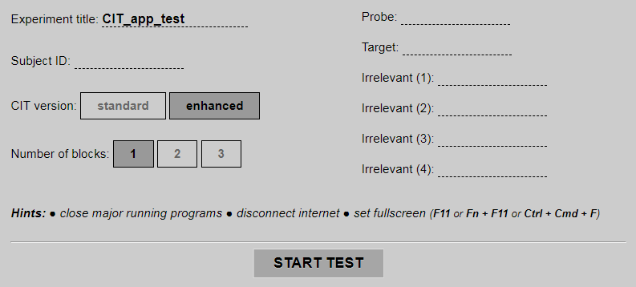

# Summary

This application implements two versions of the response time-based Concealed Information Test (RT-CIT) deception detection method: a standard version that has been often used in the recent years [@seymour2000], and a recently introduced enhanced version [@lukacs2017]. Both of these aim to reveal whether or not a certain information detail – the probe – is known to the tested person. Along with this probe, the test also contains irrelevant items that are similar to the probe, and thus indistinguishable for a person who does not know the relevance of the probe (e.g., when the probe is the brand of a stolen car, the irrelevant items are other brands). When these items are repeatedly presented in a test, a persons who recognize the relevance of the probe (e.g., because they were the ones who stole the car) will tend to make slower keypress responses to the probe than to the irrelevant items. Consequently, based on these larger probe-irrelevant response time differences, these persons can be distinguished from those who do not know the relevance of the probe (e.g., because they took no part in the stealing of the car).

While the standard version is simple in design, and therefore relatively easy to implement, the recent enhanced version [@lukacs2017] is much more complex (especially in respect of its item randomization). Therefore, the primary aim of this application is to provide a readily available tool for the independent testing and replication of this method. This application requires no technical knowledge; it can simply be opened and used in a Google Chrome browser. Furthermore, by simply uploading it on any server, it can also be made available online, where it can then be easily accessed anytime, from anywhere. One online version is always available directly via the [site of the repository itself](https://gasparl.github.io/citapp_pc/CITapp.html "CITapp"). Once loaded into the browser, it may again be used offline as well.

The startpage looks like this:

At the same time, this is the very first publicly available application for a valid, scientifically proven lie detection method. While for now it is only intended for research purposes, this may provide the basis of a freely available test that in the future may be used by appropriate investigative and other authorities all over the world. 

# Note

The basic framework of this application was first used in a recent online study; the resulting manuscript is currently under review [@lukacs2019]. An even more similar offline version is being used in a currently ongoing experiment. Still, even compared to the latter, the vital difference in the present application is the user interface that allows the task to be easily customized without any technical expertise (in particular, to conveniently enter and use any desired items for the test).

# Acknowledgments

Gáspár Lukács is a recipient of a DOC Fellowship of the Austrian Academy of Sciences at the Institute for Basic Psychological Research at the University of Vienna. Thanks to Bennett Kleinberg for inspiration.

# References